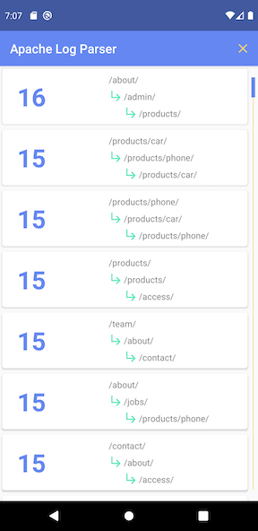

# ApacheLogParser
Simple application that pulls down an Apache server log file and analyzes it.

## Analyzing the log file
Press "Parse Logs" button to pull down the log and begin the parsing process.

The log file is pulled down and analyzed line-by-line
1) Each ip address is associated with a stream of page clicks.
2) The sites accessed are then grouped into three page sections.
3) These three continuous page clicks are counted to determine the most frequent order of sites visited.
4) The output is sorted to provide the most frequent three sequential page visits first.

The list can be cleared by pressing the 'X' icon in the top right corner. Currently, a single log is being referenced, so it will be the only file analyzed.
